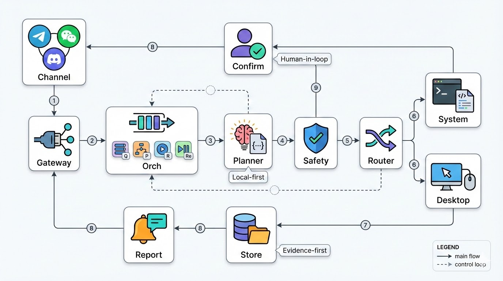

# MiniClaw

> 一个面向 AI Agent 时代的工程重建项目：
> **不是为了“再做一个产品”，而是为了真正理解现代 Agent 系统是如何工作的。**

---

## MiniClaw 是什么

**MiniClaw** 是一个以学习与架构重建为核心目标的本地优先（Local-First）Agent Runtime 项目。
它的使命不是替代 OpenClaw，而是通过“从零重建一个可运行的最小系统”，把现代 Agent 的关键机制拆开、看懂、跑通。

你可以把 MiniClaw 理解为：

- 一个可执行的 Agent 架构实验台
- 一个个人规模的 Agent 操作系统雏形
- 一个帮助开发者建立“系统级 Agent 认知”的工程项目

---

## 为什么做 MiniClaw

今天的 AI 正在从“对话助手”走向“可执行任务的智能体系统”：

- 能调用工具
- 能管理任务
- 能控制本地环境
- 能跨步骤完成工作流

但如果只把这类系统当作黑盒工具来用，很难理解它们真正的创新点。
MiniClaw 的答案是：**重建，而不是猜测。**

我们希望通过亲手实现，回答这些关键问题：

- Agent runtime 到底由哪些层组成？
- 规划、执行、工具和安全是如何协同的？
- 消息渠道和执行环境为什么必须解耦？
- 人在回路（Human-in-the-loop）该如何落地？

---

## 核心理念

MiniClaw 由以下原则驱动：

- **重建优先**：以架构学习为目标，不追求“概念创新噱头”。
- **本地优先执行**：Agent 在哪里运行，就在哪里执行动作。
- **通道解耦**：Telegram/WeChat/Discord 只是通信入口，不是 Agent 本体。
- **人在回路**：高风险动作必须可确认、可中断、可恢复。
- **结构化执行**：通过标准 action schema 与 executor 执行，避免不可控黑箱行为。
- **模块化演进**：网关、编排、规划、路由、执行、安全、上下文可独立迭代。

---

## 项目特色（为什么这个项目值得关注）

- **架构透明，不做“魔法演示”**
  从 Planner 到 Executor 的链路清晰可追踪，任务状态和执行证据可落盘复查。

- **强调“真实执行结果”而非“语言承诺”**
  MiniClaw 的目标是让系统基于真实执行结果反馈，不以“模型说已完成”作为完成标准。

- **安全机制内建，而非事后补丁**
  对高风险命令、网络动作、关键文件覆盖等行为进行确认门控。

- **天然适合学习与二次实验**
  保留规划输出、执行日志、任务摘要、工件文件，便于复盘、对比、改造。

- **面向个人开发者的可控复杂度**
  不追求“大而全”，重点是“可理解、可修改、可扩展”。

---

## 当前可实现能力

MiniClaw 目前已经具备一条可工作的最小闭环：

- 通过 Telegram（或 Mock 通道）接收任务
- 将自然语言指令转成结构化 ActionPlan
- 按动作类型分发到系统执行器与桌面执行器
- 对高风险动作进入确认状态并等待 `confirm`
- 支持任务 `pause` / `resume` / `cancel` / `append`
- 每个任务自动沉淀执行工件（plan、log、summary、截图等）

典型动作能力包括：

- 命令执行与输出采集
- 目录/文件读写
- 打开应用与 URL
- 截图与部分桌面自动化动作

---

## 项目流程图


## 项目意义

MiniClaw 的价值不在“替代谁”，而在于提供一种工程方法论：

- 用可运行系统学习复杂系统
- 用模块边界理解 AI Agent 的安全与可靠性
- 用真实执行链路建立“Agent 工程素养”

这套能力不仅适用于 MiniClaw，也适用于理解下一代开发代理、桌面代理和个人 AI 基础设施。

---

## How to Run

### 1) 环境准备

```bash
python -m venv .venv
source .venv/bin/activate
# Windows PowerShell: .\.venv\Scripts\Activate.ps1
pip install -r requirements.txt
```

### 2) 启动服务

```bash
uvicorn raida.main:app --host 0.0.0.0 --port 8000
# 或
bash scripts/start_server.sh
```

### 3) 发送测试任务（Mock Telegram）

```bash
curl -X POST http://127.0.0.1:8000/messages/telegram/mock \
  -H "Content-Type: application/json" \
  -d '{"user_id":"tg_123456789","message":"/run open VS Code and show files in ."}'
```

### 4) 常用指令

- `/run <instruction>` 新建任务
- `confirm` 或 `/confirm <task_id>` 确认高风险动作
- `/pause <task_id>` 暂停任务
- `/resume <task_id>` 恢复任务
- `/cancel <task_id>` 取消任务
- `/append <task_id> <instruction>` 追加新指令

---

## 与 OpenClaw 的深度对比

> 结论先行：两者不是替代关系，而是**定位互补**。
> OpenClaw 更像成熟系统范式，MiniClaw 更像可拆解、可学习、可改造的工程实验台。

### 1) OpenClaw 做得更好的部分（MiniClaw 尚未达到）

- **工程成熟度与规模化能力**：在稳定性、生态完整度、复杂场景覆盖方面，OpenClaw 代表更高工业化水平。
- **产品化体验**：在端到端使用体验、平台整合能力、标准化流程上通常更完善。
- **复杂任务泛化能力**：在多类型任务、长流程协同上的鲁棒性与一致性更强。
- **生态与社区势能**：文档、用户规模、案例沉淀通常更丰富，迁移与复用成本更低。

### 2) MiniClaw 已经强调、而 OpenClaw 通常不以此为核心目标的部分

- **学习导向的“可解释重建”**：MiniClaw 把“看懂系统”作为第一目标，而不是隐藏实现细节。
- **个人级本地优先实验路径**：更强调在单机环境快速重建完整 Agent 链路，便于个人开发者反复试错。
- **任务证据化沉淀**：规划原始输出、执行日志、summary、工件文件等被当作一等学习资产。
- **人在回路的强交互控制**：对高风险动作的确认、暂停/恢复/追加指令作为核心体验而非附属能力。

### 3) 一句话定位

- 如果你追求成熟产品能力与大规模实践，OpenClaw 是重要参照。
- 如果你追求“把 Agent 系统拆开并真正掌握”，MiniClaw 是更直接的工程路径。

---

## Guiding Statement

**MiniClaw 存在的原因只有一个：**

> **我们想真正回答：现代 Agent 系统在底层到底是如何运作的？**

通过重建，我们获得的不只是一个工具，而是一种面向 AI Agent 时代的系统工程理解力。
