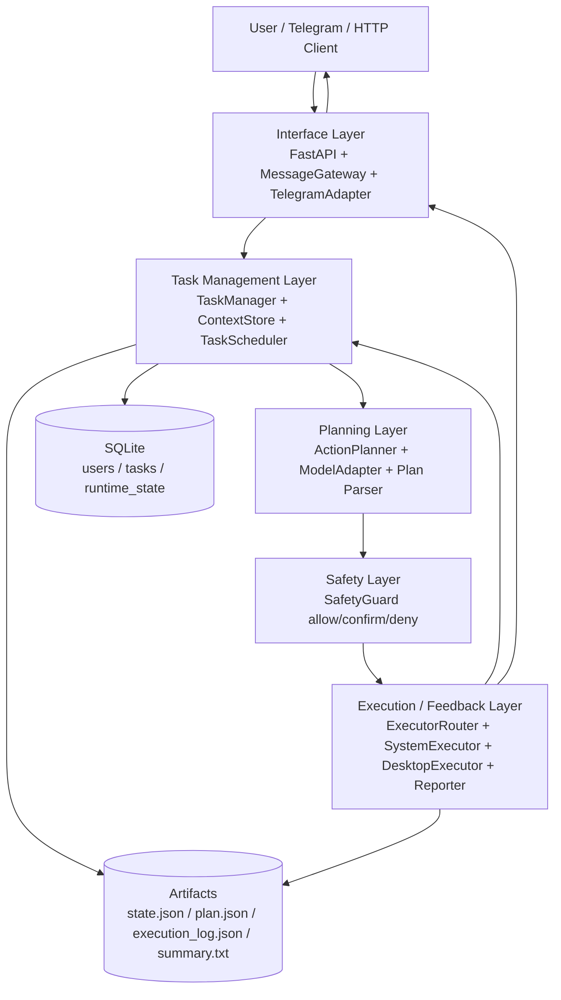

# MiniClaw 使用手册

这份文档面向第一次接触 MiniClaw 的开发者，目标是回答四类问题：

- 这个系统顶层怎么设计
- 模型怎么选、怎么接、怎么配
- 服务怎么启动、机器人怎么接入、API 怎么调用
- 任务状态、指令和执行产物分别怎么看

## 1. 系统定位

MiniClaw 不是一个“聊天机器人壳子”，而是一个本地优先的 agent runtime。  
它的基本运行方式是：

1. 接收自然语言任务
2. 规划成结构化 `ActionPlan`
3. 经过统一安全判定
4. 执行本地动作
5. 把结果、日志和工件回传给用户

当前阶段的目标不是做成熟多租户平台，而是把单机个人 agent 的主链路做对：

- 安全边界明确
- 模型 provider 可切换
- Linux 主路径稳定
- 开发任务优先走结构化工具

## 2. 顶层架构图



## 3. 五层设计说明

### 3.1 Interface Layer

代码位置：

- `src/main.py`
- `src/gateway/message_gateway.py`
- `src/gateway/telegram_adapter.py`

职责：

- 接收 HTTP 请求
- 接收 Telegram 消息
- 把外部消息统一成内部 task 操作

当前支持两种入口：

- FastAPI HTTP 接口
- Telegram Bot / Mock Telegram

其中 `MessageGateway` 是统一入口抽象，`TelegramAdapter` 是实际消息适配器。

### 3.2 Task Management Layer

代码位置：

- `src/orchestrator/task_manager.py`
- `src/orchestrator/context_store.py`
- `src/orchestrator/task_scheduler.py`

职责：

- 创建和持久化任务
- 维护任务状态机
- 排队执行任务
- 管理 pause / resume / cancel / confirm
- 保存 planner 输出和执行工件

实现方式：

- `TaskManager` 用 SQLite 存 `tasks`、`users`、`runtime_state`
- `ContextStore` 用文件系统存每个任务的产物
- `TaskScheduler` 用单 worker 线程串行调度任务

### 3.3 Planning Layer

代码位置：

- `src/planner/codex_planner.py`
- `src/planner/action_models.py`
- `src/planner/plan_parser.py`
- `src/models/*`
- `prompts/action_planner.md`

职责：

- 把用户目标转换成严格 JSON 的 `ActionPlan`
- 校验 action schema
- 隔离底层模型 provider

当前模型层已经是 provider 抽象：

- `codex_cli`
- `openai_compatible`

规划器只依赖统一的 `ModelAdapter` 返回文本，不依赖 CLI 还是 HTTP。

### 3.4 Safety Layer

代码位置：

- `src/safety/safety_guard.py`

职责：

- 在 runtime 内统一做风险判定
- 不是黑名单拦截，而是结构化决策

决策结果只有三种：

- `allow`
- `confirm`
- `deny`

覆盖动作：

- `run_command`
- `write_file`
- `open_url`
- GUI 动作
- `request_confirmation`

### 3.5 Execution / Feedback Layer

代码位置：

- `src/executors/executor_router.py`
- `src/executors/system_executor.py`
- `src/executors/desktop_executor.py`
- `src/orchestrator/reporter.py`
- `src/utils/command_runner.py`

职责：

- 执行真正的副作用动作
- 采集 stdout/stderr、截图、文件工件
- 回传执行状态和摘要

执行能力被拆成两类：

- 核心执行能力：shell、文件、搜索、浏览器、截图
- 可选桌面能力：窗口聚焦、键盘输入、鼠标点击、打开应用

## 4. 目录结构

建议从下面这些目录理解项目：

```text
src/
  main.py                 FastAPI 入口
  config.py               配置加载
  gateway/                Telegram 与消息网关
  orchestrator/           任务、状态、调度、报告
  planner/                Prompt、Plan 模型、Plan 解析
  models/                 模型 provider 抽象与工厂
  safety/                 安全决策
  executors/              系统执行器与桌面执行器
  utils/                  命令执行、路径、安全日志、截图

prompts/
  action_planner.md       planner system prompt

data/
  src.db                SQLite 数据库
  tasks/<task_id>/        单个任务的所有运行产物

docs/
  01~04 spec             设计规格
  05_user_manual.md      当前使用手册
```

## 5. 一次完整任务是怎么跑的

以 `/run inspect the repo and summarize entrypoints` 为例：

1. 用户通过 Telegram 或 HTTP 提交消息
2. `main.py` 把消息解析成 task 操作
3. `TaskManager.create_task()` 创建任务，初始状态是 `pending`
4. `TaskScheduler` 取到任务后进入 `planning`
5. `ActionPlanner` 调模型，生成 `ActionPlan`
6. `SafetyGuard` 逐个动作做 `allow / confirm / deny`
7. `ExecutorRouter` 把动作路由给 `SystemExecutor` 或 `DesktopExecutor`
8. 执行结果被写入：
   - SQLite 任务状态
   - `data/tasks/<task_id>/state.json`
   - `data/tasks/<task_id>/execution_log.json`
   - `data/tasks/<task_id>/logs/execution.log`
   - `summary.txt` 等工件
9. `Reporter` 把阶段性结果和最终摘要发回用户

## 6. 模型如何选择

### 6.1 当前支持的 provider

#### `codex_cli`

适用场景：

- 你本机已经安装 `codex` CLI
- 你希望 planner 通过本地 CLI 调模型

实现文件：

- `src/models/codex_cli_adapter.py`

特点：

- 通过 shell 调 `codex exec`
- 支持设置超时
- 支持指定 CLI 路径

#### `openai_compatible`

适用场景：

- 你要接 OpenAI-compatible API
- 你要把 Kimi / Minimax / 其他兼容 Chat Completions 的服务接到 MiniClaw

实现文件：

- `src/models/openai_compatible_adapter.py`

特点：

- 请求 `POST {api_base}/chat/completions`
- 请求体使用标准 `messages` 格式
- 支持 `Authorization: Bearer <api_key>`

### 6.2 选型建议

- 你本机主要做个人开发实验：优先 `codex_cli`
- 你要快速切换不同云端模型：优先 `openai_compatible`
- 你想接 Kimi / Minimax：前提是它们提供 OpenAI-compatible Chat Completions 接口

### 6.3 模型配置示例

#### 方案 A：Codex CLI

```bash
export SRC_MODEL_PROVIDER=codex_cli
export SRC_MODEL_NAME=codex
export SRC_CODEX_CLI_PATH=codex
export SRC_CODEX_SKIP_GIT_REPO_CHECK=true
export SRC_MODEL_TIMEOUT=1800
export SRC_MODEL_TEMPERATURE=0
```

#### 方案 B：OpenAI-compatible API

```bash
export SRC_MODEL_PROVIDER=openai_compatible
export SRC_MODEL_NAME=gpt-4.1-mini
export SRC_MODEL_API_BASE=https://your-api-base.example/v1
export SRC_MODEL_API_KEY=your_api_key
export SRC_MODEL_TIMEOUT=1800
export SRC_MODEL_TEMPERATURE=0
```

### 6.4 MiniClaw 对 API 的要求

如果你接的是 HTTP provider，MiniClaw 预期你的服务满足：

- 基础地址是 `SRC_MODEL_API_BASE`
- 实际调用路径是 `SRC_MODEL_API_BASE + /chat/completions`
- 支持 `messages`
- 返回 `choices[0].message.content`

最小兼容返回形态大致是：

```json
{
  "model": "your-model",
  "choices": [
    {
      "message": {
        "content": "{...ActionPlan JSON...}"
      },
      "finish_reason": "stop"
    }
  ],
  "usage": {
    "prompt_tokens": 123,
    "completion_tokens": 456,
    "total_tokens": 579
  }
}
```

## 7. 全部配置项

MiniClaw 当前不自动读取 `.env` 文件。  
也就是说，配置方式是：

- 直接 `export` 环境变量
- 或者用 shell 脚本封装后再启动
- 或者在容器 / systemd / CI 环境里注入环境变量

### 7.1 服务与路径配置

| 环境变量 | 默认值 | 说明 |
|---|---|---|
| `SRC_HOST` | `0.0.0.0` | FastAPI 监听地址 |
| `SRC_PORT` | `8000` | FastAPI 监听端口 |
| `SRC_DB_PATH` | `data/src.db` | SQLite 数据库路径 |
| `SRC_TASK_DATA_DIR` | `data/tasks` | 每个任务工件保存目录 |
| `SRC_PLANNER_PROMPT_FILE` | `prompts/action_planner.md` | planner prompt 文件 |
| `SRC_ALLOWED_WORKDIRS` | 当前工作目录 | 允许访问和写入的根目录列表，逗号分隔 |
| `SRC_COMMAND_TIMEOUT` | `1800` | 命令执行默认超时，秒 |
| `SRC_SHELL_EXECUTABLE` | Linux/macOS 自动探测 `bash/zsh/sh`，Windows 用 `cmd.exe` | `run_command` 的 shell |
| `SRC_LOG_LEVEL` | `INFO` | 日志级别 |

### 7.2 模型配置

| 环境变量 | 默认值 | 说明 |
|---|---|---|
| `SRC_MODEL_PROVIDER` | `codex_cli` | 模型 provider，支持 `codex_cli` / `openai_compatible` |
| `SRC_MODEL_NAME` | `codex` | 模型名 |
| `SRC_MODEL_API_BASE` | 空 | OpenAI-compatible 接口基地址 |
| `SRC_MODEL_API_KEY` | 空 | OpenAI-compatible 接口密钥 |
| `SRC_MODEL_TIMEOUT` | `1800` | 模型调用超时 |
| `SRC_MODEL_TEMPERATURE` | `0.0` | planner 采样温度 |
| `SRC_CODEX_CLI_PATH` | `codex` | Codex CLI 可执行文件 |
| `SRC_CODEX_SKIP_GIT_REPO_CHECK` | `true` | 是否给 codex CLI 加 `--skip-git-repo-check` |

### 7.3 安全配置

| 环境变量 | 默认值 | 说明 |
|---|---|---|
| `SRC_CONFIRM_NETWORK` | `true` | 网络相关动作是否默认要求确认 |
| `SRC_CONFIRM_OVERWRITE` | `true` | 覆盖已有文件是否要求确认 |

### 7.4 Telegram 配置

| 环境变量 | 默认值 | 说明 |
|---|---|---|
| `SRC_TELEGRAM_BOT_TOKEN` | 空 | Telegram Bot Token；为空时自动降级为 Mock 模式 |
| `SRC_TELEGRAM_ALLOWED_CHAT_IDS` | 空 | 允许访问的 chat id 列表，逗号分隔；为空表示不做 chat 白名单 |
| `SRC_TELEGRAM_INVITE_CODE` | 空 | 注册邀请码；为空则 `/register` 不需要邀请码 |
| `SRC_TELEGRAM_REQUIRE_REGISTRATION` | `true` | 是否启用注册机制 |
| `SRC_TELEGRAM_POLL_TIMEOUT` | `30` | Telegram 长轮询超时 |
| `SRC_TELEGRAM_POLL_RETRY` | `3` | 轮询失败重试间隔 |

## 8. 如何修改配置

最直接的方式是在 shell 中先导出环境变量，再启动服务。

示例：

```bash
export SRC_MODEL_PROVIDER=openai_compatible
export SRC_MODEL_NAME=your-model
export SRC_MODEL_API_BASE=https://your-api/v1
export SRC_MODEL_API_KEY=your-key
export SRC_ALLOWED_WORKDIRS=/home/me/project,/home/me/sandbox
export SRC_TELEGRAM_BOT_TOKEN=123456:ABCDEF
export SRC_TELEGRAM_REQUIRE_REGISTRATION=false
```

如果你更希望固定成一个启动脚本，可以新建本地脚本，例如：

```bash
#!/usr/bin/env bash
set -euo pipefail

export SRC_MODEL_PROVIDER=openai_compatible
export SRC_MODEL_NAME=your-model
export SRC_MODEL_API_BASE=https://your-api/v1
export SRC_MODEL_API_KEY=your-key
export SRC_ALLOWED_WORKDIRS=/home/me/project
export SRC_TELEGRAM_BOT_TOKEN=123456:ABCDEF

uvicorn src.main:app --host 0.0.0.0 --port 8000
```

注意：上面最后一行是“设计目标下的启动方式”。  
当前仓库有一个包路径迁移中的已知问题，见本文最后的“已知问题”。

## 9. 如何部署 API 服务

### 9.1 Python 环境准备

```bash
python -m venv .venv
source .venv/bin/activate
pip install -r requirements.txt
```

### 9.2 理想启动方式

README 和 `scripts/start_server.sh` 当前假设入口是：

```bash
uvicorn src.main:app --host 0.0.0.0 --port 8000
```

或：

```bash
bash scripts/start_server.sh
```

如果你希望把所有配置集中放在一个脚本里直接启动，推荐使用：

```bash
bash scripts/run_miniclaw.sh
```

这个脚本会：

- 在脚本顶部集中声明全部 `SRC_*` 环境变量
- 自动激活本地 `.venv`（如果存在）
- 自动创建数据库目录和任务目录
- 自动启动 `uvicorn src.main:app`

### 9.3 HTTP 接口

当前可用的 API 路径包括：

| 方法 | 路径 | 作用 |
|---|---|---|
| `GET` | `/healthz` | 健康检查 |
| `GET` | `/health` | 健康检查 |
| `POST` | `/messages/telegram/mock` | 模拟 Telegram 发消息 |
| `POST` | `/tasks` | 创建任务 |
| `GET` | `/tasks` | 列表任务 |
| `GET` | `/tasks/{task_id}` | 查看任务 |
| `POST` | `/tasks/{task_id}/pause` | 暂停任务 |
| `POST` | `/tasks/{task_id}/resume` | 恢复任务 |
| `POST` | `/tasks/{task_id}/cancel` | 取消任务 |
| `POST` | `/tasks/{task_id}/append` | 追加指令 |
| `POST` | `/tasks/confirm` | 确认高风险动作 |
| `GET` | `/users` | 列出用户 |

### 9.4 HTTP 示例

创建任务：

```bash
curl -X POST http://127.0.0.1:8000/tasks \
  -H "Content-Type: application/json" \
  -d '{
    "user_id": "tg_123456789",
    "instruction": "inspect the current project and summarize its entrypoints",
    "working_directory": "/home/me/project"
  }'
```

确认等待中的动作：

```bash
curl -X POST http://127.0.0.1:8000/tasks/confirm \
  -H "Content-Type: application/json" \
  -d '{
    "user_id": "tg_123456789",
    "message": "confirm"
  }'
```

Mock Telegram：

```bash
curl -X POST http://127.0.0.1:8000/messages/telegram/mock \
  -H "Content-Type: application/json" \
  -d '{
    "user_id": "tg_123456789",
    "message": "/run inspect the current project and summarize its entrypoints"
  }'
```

## 10. 如何创建 Telegram 机器人

MiniClaw 现在只内建了 Telegram adapter，没有内建微信或 Discord adapter 的可用实现。

标准接入流程如下：

1. 在 Telegram 中找到 `@BotFather`
2. 发送 `/newbot`
3. 按提示设置机器人名称和用户名
4. 记录 BotFather 返回的 bot token
5. 设置：

```bash
export SRC_TELEGRAM_BOT_TOKEN=<your_token>
```

6. 启动 MiniClaw 后，机器人会使用 Bot API 长轮询收消息

### 10.1 如何限制谁能使用机器人

可用两个机制：

- chat 白名单：`SRC_TELEGRAM_ALLOWED_CHAT_IDS`
- 注册机制：`SRC_TELEGRAM_REQUIRE_REGISTRATION` + `SRC_TELEGRAM_INVITE_CODE`

推荐做法：

- 个人使用：先把 `SRC_TELEGRAM_ALLOWED_CHAT_IDS` 留空，再用注册机制控入口
- 只给自己用：直接把自己的 chat id 配进 `SRC_TELEGRAM_ALLOWED_CHAT_IDS`

### 10.2 如何拿到 chat id

当前最简单的方式是：

1. 先不设置 `SRC_TELEGRAM_ALLOWED_CHAT_IDS`
2. 给机器人发 `/start`
3. 通过 `/users` 接口或 SQLite 的 `users` 表查看产生的 `user_id`
4. `user_id` 是 `tg_<chat_id>` 形式，真实 chat id 就是去掉前缀后的数字

## 11. 如何控制自己的机器

MiniClaw 不是远程桌面，它控制机器的方式是“结构化动作 + 执行器”。

### 11.1 核心执行能力

这些能力是主路径：

- `run_command`
- `list_directory`
- `read_file`
- `write_file`
- `find_files`
- `search_text`
- `read_multiple_files`
- `get_system_info`
- `open_url`
- `take_screenshot`

这些动作主要由 `SystemExecutor` 完成，重点是：

- 更稳定
- 更适合代码和文件任务
- 不依赖屏幕坐标

### 11.2 可选桌面能力

这些动作是增强能力，不是主路径：

- `open_application`
- `focus_window`
- `type_text`
- `press_key`
- `mouse_click`

它们由 `DesktopExecutor` 完成，依赖：

- `pyautogui`
- `pygetwindow`
- 本地 GUI 环境

所以它的特点是：

- 能做桌面自动化
- 但稳定性弱于文件/命令类动作
- 风险更高，默认要求更严格确认

### 11.3 机器控制边界

真正决定“能控制到哪里”的，不是模型，而是 runtime 配置：

- `SRC_ALLOWED_WORKDIRS` 决定可访问工作区
- `SafetyGuard` 决定哪些动作 `allow / confirm / deny`
- `require_confirmation_for_overwrite` 控制文件覆盖门槛
- `require_confirmation_for_network` 控制联网确认门槛

## 12. 任务状态有哪些

任务状态定义在 `src/orchestrator/task_manager.py`。

### 12.1 Task 状态

| 状态 | 含义 |
|---|---|
| `pending` | 已创建，等待调度，或被 pause 后待恢复 |
| `planning` | 正在调用 planner 生成 ActionPlan |
| `running` | 正在执行某个 action |
| `awaiting_confirmation` | 有高风险动作等待用户确认 |
| `waiting_confirmation` | 兼容旧状态名，逻辑上等同于等待确认 |
| `completed` | 任务执行完成 |
| `failed` | planner 失败、action 失败或 action 被 deny |
| `cancelled` | 用户取消 |

### 12.2 User 状态

| 状态 | 含义 |
|---|---|
| `pending` | 用户存在但未激活 |
| `active` | 用户已激活，可提交任务 |
| `blocked` | 用户被封禁 |

### 12.3 current_step 常见值

`current_step` 不是枚举，而是运行时字符串。常见值包括：

- `created`
- `planning actions`
- `action[0] read_file`
- `awaiting user confirmation`
- `paused by user`
- `resume requested`
- `action failed`
- `action denied`
- `done`

## 13. Telegram 可用指令

当前 `main.py` 内建的用户指令如下：

| 指令 | 作用 |
|---|---|
| `/start` | 显示欢迎信息和 onboarding |
| `/help` | 显示帮助 |
| `/register` 或 `/register <invite_code>` | 激活用户 |
| `/run <instruction>` | 创建任务 |
| `/pause <task_id>` | 暂停任务 |
| `/resume <task_id>` | 恢复任务 |
| `/cancel <task_id>` | 取消任务 |
| `/append <task_id> <instruction>` | 追加新的用户指令 |
| `/tasks` | 查看最近任务 |
| `/task <task_id>` | 查看某个任务状态 |
| `confirm` | 确认最近一个等待确认的任务 |
| `/confirm <task_id>` | 确认指定任务 |

## 14. 高风险动作怎么确认

如果 `SafetyGuard` 判定结果是 `confirm`：

1. 任务状态会变成 `awaiting_confirmation`
2. Reporter 会把原因和 preview 发给用户
3. 用户回复：
   - `confirm`
   - 或 `/confirm <task_id>`
4. Scheduler 收到确认后继续执行当前 action

如果判定结果是 `deny`：

- 当前 action 不会执行
- 任务直接进入 `failed`
- `execution_log.json` 会记录 `denied`

## 15. 安全策略怎么理解

当前安全机制不是“多拦几个命令”，而是统一决策。

### 15.1 典型 `deny`

- `rm -rf /`
- `mkfs`
- `fdisk`
- `shutdown`
- 写入敏感路径，例如：
  - `/etc`
  - `/usr`
  - `/root`
  - `.ssh`
  - `.gnupg`

### 15.2 典型 `confirm`

- `pip install`
- `npm install`
- `curl` / `wget`
- `git pull` / `git clone`
- `kill` / `systemctl stop`
- 覆盖已有文件
- GUI 输入控制
- `open_url`

### 15.3 典型 `allow`

- `read_file`
- `find_files`
- `search_text`
- `read_multiple_files`
- `get_system_info`
- 普通低风险 shell 命令

## 16. 每个任务会产出什么文件

任务工件默认在：

```text
data/tasks/<task_id>/
```

典型文件包括：

| 文件 | 含义 |
|---|---|
| `state.json` | 当前运行状态 |
| `conversation.jsonl` | 用户与 assistant 的任务级对话 |
| `plan.json` | planner 解析后的原始计划 |
| `execution_plan.json` | 可执行 action 序列 |
| `execution_log.json` | 每个 action 的执行记录 |
| `planner_raw.txt` | planner 原始输出 |
| `planner_cleaned.txt` | parser 清洗后的输出 |
| `planner_error.txt` | 规划失败时的错误信息 |
| `summary.txt` | 最终摘要 |
| `logs/execution.log` | 运行日志 |
| `stdout.txt` / `stderr.txt` | shell 命令输出 |
| `screenshots/*.png` | 截图 |
| `patches/*.diff` | `respond_only` 或后续 patch 产物 |

## 17. 如何看系统是否正常运行

### 17.1 最小检查

- `GET /healthz` 返回 `{"status":"ok"}`
- `GET /users` 能返回用户列表
- `POST /messages/telegram/mock` 能创建任务
- `data/src.db` 正常产生 `tasks` 和 `users` 数据

### 17.2 常见观察面

- FastAPI 服务日志
- `data/tasks/<task_id>/state.json`
- `data/tasks/<task_id>/execution_log.json`
- Telegram 回消息是否正常

## 18. 建议的最小上线方式

如果你只是先把 MiniClaw 跑通，建议按下面顺序：

1. 不接 Telegram，先用 Mock 模式
2. 模型先选一个你已经打通的 provider
3. `SRC_ALLOWED_WORKDIRS` 只放一个沙箱目录
4. 先跑只读类任务：
   - read repo
   - search text
   - summarize structure
5. 等状态流转、日志和安全确认都正常，再打开写文件或 GUI 动作

## 19. 包名约定

当前仓库已经统一使用 `src` 作为 Python package 名称。

这意味着：

- 代码导入统一写成 `from src...`
- 服务启动入口统一写成 `src.main:app`
- 文档和提示词中的源码路径统一写成 `src/...`
- 配置环境变量前缀统一写成 `SRC_*`
