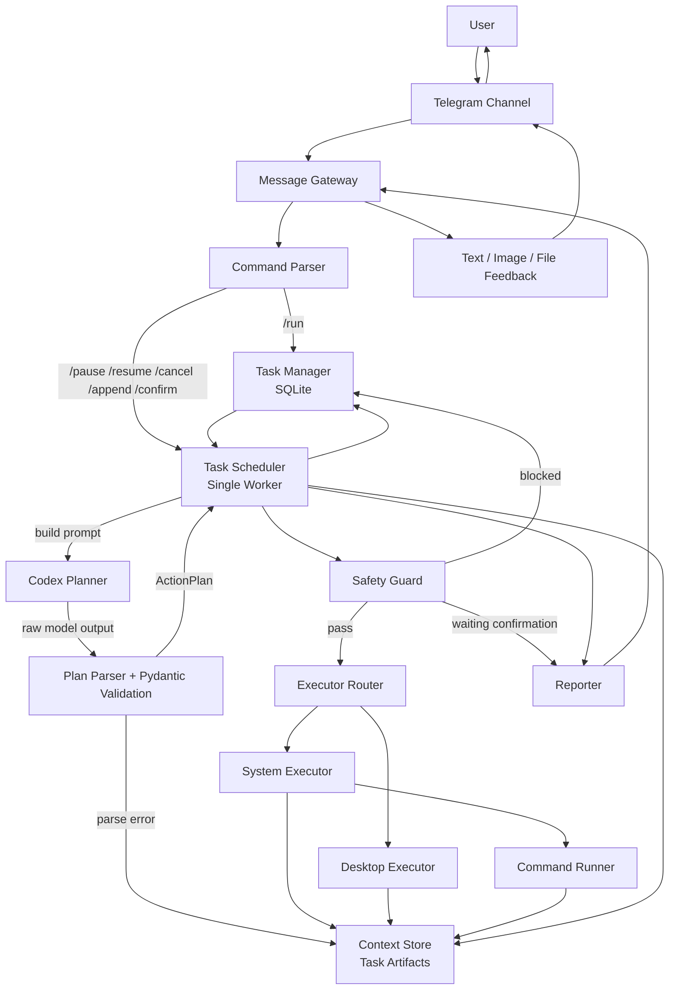

# MiniClaw 技术报告

## 1. 项目定位

MiniClaw 当前已经具备一个最小可运行的本地优先 Agent Runtime。它不是单纯的聊天机器人，也不是把模型输出直接当作执行结果，而是将自然语言任务拆成结构化计划，再经过安全检查和本地执行器落地。

从代码实现上看，MiniClaw 的核心目标已经很明确：

- 让消息通道和执行运行时分离
- 让模型只负责规划，不直接负责执行
- 让执行结果必须来自本地真实动作
- 让高风险动作进入人工确认环节
- 让每个任务都留下可复盘的工件和证据

---

## 2. 总体架构图

---

## 3. 分层架构详解

### 3.1 接入层：消息通道与 API 入口

入口文件是 `src/main.py`。当前系统有两类入口：

- Telegram 消息入口
- FastAPI 任务入口

Telegram 侧通过 `MessageGateway + TelegramAdapter` 收消息并回消息。FastAPI 侧暴露 `/tasks`、`/tasks/{task_id}`、`/messages/telegram/mock` 等接口。

这一层做的不是业务执行，而是：

- 把外部消息转换成统一的内部命令
- 做用户身份检查和注册状态检查
- 将消息转成任务创建、任务控制或确认动作

当前支持的核心控制指令包括：

- `/run`
- `/pause`
- `/resume`
- `/cancel`
- `/append`
- `confirm`
- `/confirm <task_id>`
- `/tasks`
- `/task <task_id>`

这一层的价值是把“聊天输入”变成“任务系统输入”。

---

### 3.2 网关层：Channel Adapter 抽象

当前网关位于：

- `src/gateway/message_gateway.py`
- `src/gateway/telegram_adapter.py`

虽然名字上是 `MessageGateway`，但目前实际上仍偏 Telegram 专用，因为内部抽象接口仍然是 `TelegramAdapter` 风格。

当前已经实现的能力有：

- Mock Telegram 适配器
- Telegram Bot API 适配器
- 长轮询收消息
- 发文本消息
- 发图片
- 发文件
- offset 持久化

这说明 Telegram 已经不只是“能接上”，而是已经成为一个可靠可用的控制通道。

---

### 3.3 控制层：任务模型与状态机

任务持久化在 `src/orchestrator/task_manager.py`。

这里用 SQLite 管理：

- 任务基本信息
- 当前状态
- 当前步骤
- 用户信息
- 历史记录
- 待确认动作
- runtime 状态

当前任务状态包括：

- `pending`
- `planning`
- `running`
- `awaiting_confirmation`
- `completed`
- `failed`
- `cancelled`

这说明 MiniClaw 不是同步一次性调用，而是一个真正带状态的任务运行时。

一个任务从创建到完成的标准路径大致是：

1. 用户发送 `/run <instruction>`
2. 系统创建 task
3. 调度器取出 task
4. 进入 planning
5. 得到结构化 ActionPlan
6. 对每个 action 逐步执行
7. 若遇到高风险动作则进入等待确认
8. 确认后从当前 cursor 继续
9. 全部完成后写 summary 并回报

---

### 3.4 编排层：TaskScheduler 是系统核心

调度器位于 `src/orchestrator/task_scheduler.py`。

它是整个系统最重要的 runtime 核心，负责：

- 后台 worker 循环
- 任务排队与去重
- 调 planner
- 调 safety guard
- 调 executor router
- 管理暂停、恢复、取消、追加指令
- 管理 confirmation 断点恢复
- 写执行记录
- 写最终 summary

这个调度器的结构是典型的 Agent Runtime 控制循环：

1. 先确保计划存在
2. 再按 cursor 逐个执行 action
3. 每一步执行前先过安全门
4. 每一步执行后写执行记录
5. 若任务被用户干预则改变状态机

当前的一个明显特点是：

- 它是 `single-worker`

这意味着当前系统更适合个人使用和学习验证，不适合大量并发任务。

---

### 3.5 规划层：模型只负责出计划

规划相关代码在：

- `src/planner/action_models.py`
- `src/planner/codex_planner.py`
- `src/planner/plan_parser.py`
- `prompts/action_planner.md`

#### ActionPlan 设计

MiniClaw 把模型输出限制成一个 `ActionPlan`：

- `task_id`
- `goal`
- `actions`
- `final_response_style`
- `planner_notes`

其中每个 `PlannedAction` 至少包含：

- `action_type`
- `args`
- `reason`
- `risk_level`
- `requires_confirmation`

这是当前架构里最关键的边界之一。

它的意义是：

- 模型不能直接执行系统动作
- 模型必须先给出一个可验证的中间表示
- 执行器只认结构化 action，不认自然语言

#### Parser 的价值

`plan_parser.py` 做了三层防护：

1. 从原始输出里提取 JSON 对象
2. 检测模型是不是返回了 schema/contract 而不是实例
3. 用 Pydantic 校验字段完整性和类型正确性

这意味着即使模型行为不稳定，系统也不会直接把垃圾输出送去执行。

---

### 3.6 执行层：System Executor 与 Desktop Executor 分离

执行分发位于 `src/executors/executor_router.py`。

当前有两个执行器：

#### System Executor

位于 `src/executors/system_executor.py`，负责：

- `run_command`
- `list_directory`
- `read_file`
- `write_file`
- `request_confirmation`
- `respond_only`

这是当前最稳定、最重要的一条执行线。

它的特点：

- 真正在本地运行命令
- 产出 `stdout/stderr`
- 落盘执行工件
- 对路径和工作目录做 allowed workdirs 限制

从工程角度看，这条线是 MiniClaw 最值得继续强化的部分，因为它直接决定“能不能可靠做更多事”。

#### Desktop Executor

位于 `src/executors/desktop_executor.py`，负责：

- 打开应用
- 打开 URL
- 截图
- 聚焦窗口
- 键盘输入
- 按键
- 鼠标点击

但目前这部分有明显限制：

- 偏 Windows
- 直接使用 `cmd /c start`
- 应用名和行为写死
- GUI 自动化可靠性还不高
- Linux/macOS 上没有形成稳定抽象

所以如果你未来要在 Linux 优先的方向上继续做，执行层的重点应该从“GUI 操作”转向“系统命令、文件系统、浏览器自动化、容器化工具执行”。

---

### 3.7 安全层：已经有门，但门还不够厚

安全策略位于 `src/safety/safety_guard.py`。

当前会要求确认的情况包括：

- 显式高风险动作
- 高风险命令模式
- 覆盖关键文件
- 网络 URL 打开

它现在的核心思想是对的：

- 风险前置
- 阻塞执行
- 等待人工确认

但还比较薄，原因有三点：

1. 主要基于字符串模式匹配
2. 还没有用户级、任务级、目录级细粒度权限模型
3. 还没有真正的隔离执行环境

所以它目前更像“第一道栅栏”，还不是“完整安全体系”。

---

### 3.8 观测与证据层：Context Store 很重要

上下文与工件存储在 `src/orchestrator/context_store.py`。

每个任务会有独立目录：

`data/tasks/{task_id}/`

其中可能包含：

- `conversation.jsonl`
- `state.json`
- `plan.json`
- `execution_plan.json`
- `execution_log.json`
- `summary.txt`
- `planner_raw.txt`
- `planner_cleaned.txt`
- `logs/execution.log`
- `screenshots/`
- `patches/`

这层非常适合做：

- 调试
- 审计
- 失败复盘
- 行为分析
- 后续训练数据沉淀

它是 MiniClaw 未来做可靠性和安全增强的基础。

---

## 4. 当前系统的真实优势

### 4.1 最大优势：Planner / Executor 边界清楚

你的系统没有让模型“直接接管电脑”，而是让模型先输出结构化计划，再由系统决定执行与否。这是一个非常正确的架构选择。

### 4.2 第二个优势：任务是可中断和可恢复的

`pause / resume / cancel / append / confirm` 已经构成一个比较完整的人在回路闭环。

### 4.3 第三个优势：执行结果有证据

你不是用模型说“做完了”来代表完成，而是让命令输出、文件工件、截图和日志成为完成依据。

---

## 5. 当前系统的主要短板

### 5.1 能力边界仍偏窄

虽然已经有执行器，但能做的动作种类还不够丰富。系统更像“命令执行器 + 一些桌面动作”，还没有形成更强的工具生态。

### 5.2 跨平台能力不均衡

System Executor 跨平台潜力不错，但 Desktop Executor 明显偏 Windows。若要优先支持 Linux，现有桌面动作设计需要重构。

### 5.3 安全仍偏轻

当前安全机制还停留在规则和人工确认层面，缺少强隔离、权限模型、命令风险分析和执行沙箱。

### 5.4 并发能力有限

当前是单 worker。对个人实验足够，但未来若任务变多，会出现阻塞问题。

---

## 6. 你现在提出的三个目标，分别意味着什么

### 6.1 目标一：能力更强，能做更多事

这不只是“多加几个 action_type”，而是要决定系统未来是偏哪种 agent：

- 开发者代理
- 本地自动化代理
- 浏览器任务代理
- 通用工作流代理

以你当前架构，最自然的演进方向是：

- 强化开发者任务能力
- 强化文件系统与 shell 能力
- 增加浏览器自动化能力
- 增加结构化工具接口，而不是堆更多 GUI 点击动作

更具体地说，可以优先补：

- git 操作工具
- 搜索与代码分析工具
- 补丁生成与应用工具
- 浏览器页面读取与表单操作
- 进程管理
- 服务管理
- 项目脚手架和测试工具

---

### 6.2 目标二：跨平台，优先 Linux，然后 macOS，再考虑 Windows

如果你真的要按这个目标推进，必须承认一件事：

- 当前 Desktop Executor 的设计方向要降权

因为真正跨平台、稳定、可维护的 agent，优先级应该是：

1. shell / file / process / network / browser
2. 再考虑 GUI automation

也就是说，跨平台的核心不是“鼠标点击哪里都能点”，而是：

- 尽量把动作抽象成系统级、语义级动作
- 少依赖屏幕坐标
- 少依赖具体窗口标题
- 少依赖某个桌面环境

Linux 优先时，更建议把能力重心放在：

- 命令执行
- 文件读写
- 服务和进程控制
- Playwright 浏览器自动化
- 容器化隔离执行

---

### 6.3 目标三：更安全，不会出现对计算机不利的操作

这件事不能只靠“危险命令字符串黑名单”。

如果你真要把安全做厚，应该分成四层：

#### 第一层：规划约束

让 planner 在 prompt 层就被明确约束：

- 默认不执行破坏性命令
- 默认不联网安装
- 默认不改关键文件
- 默认优先只读探测

#### 第二层：动作级风险分类

不是只看字符串，而是对动作做结构化风险评分：

- 文件删除
- 目录递归修改
- 包安装
- 长时间进程
- 远程网络访问
- 系统级权限动作

#### 第三层：执行隔离

这是最关键的安全提升点。可以考虑：

- 受限工作目录
- 容器执行
- 低权限子进程
- 临时工作副本
- 可回滚的 patch 流程

#### 第四层：审批与审计

包括：

- 用户确认
- 执行前预览
- 任务级审计日志
- 哪个动作在什么时间改了什么

当前 MiniClaw 只比较完整地实现了第二层的一部分和第四层的一部分。

---

## 7. 面向下一阶段的推荐演进路线

### 阶段 A：把基础做厚

- 重构 channel 抽象，但继续只用 Telegram
- 强化 `SystemExecutor`
- 把动作能力优先向 Linux 友好方向扩展
- 清理 Windows 特化桌面逻辑

### 阶段 B：把安全做厚

- 引入分级权限模型
- 引入 dry-run / preview
- 引入更严格的文件写入策略
- 对高风险命令改成 deny-by-default
- 尝试容器或隔离子进程执行

### 阶段 C：把能力做深

- 浏览器自动化
- 代码库分析工具
- patch 应用与回滚
- 项目级记忆和上下文管理

---

## 8. 结论

MiniClaw 当前已经具备现代 Agent Runtime 的最核心骨架：

- 有接入层
- 有控制层
- 有规划层
- 有执行层
- 有安全层
- 有证据层

它现在最大的问题不是“没有架构”，而是“架构已经成立，但执行能力、跨平台抽象和安全厚度还不够”。

如果后续继续开发，最合理的方向不是继续加更多消息通道，而是：

- 继续只用 Telegram 作为控制面
- 把运行时能力做强
- 把 Linux 优先的跨平台执行模型做稳
- 把安全体系从规则拦截提升到隔离执行

这会让 MiniClaw 从“一个学习型原型”真正走向“一个可靠的个人 Agent Runtime”。
